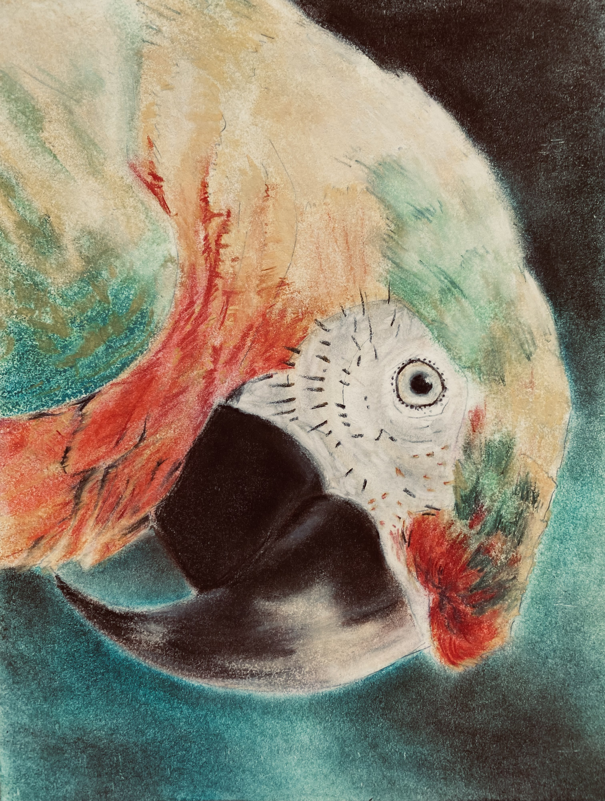
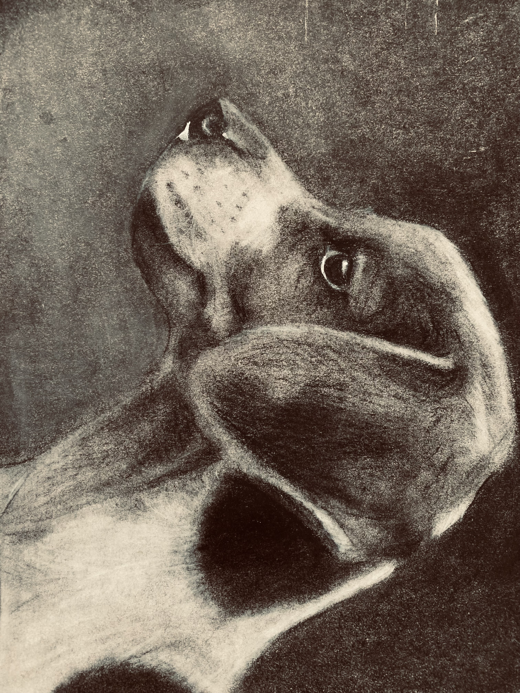
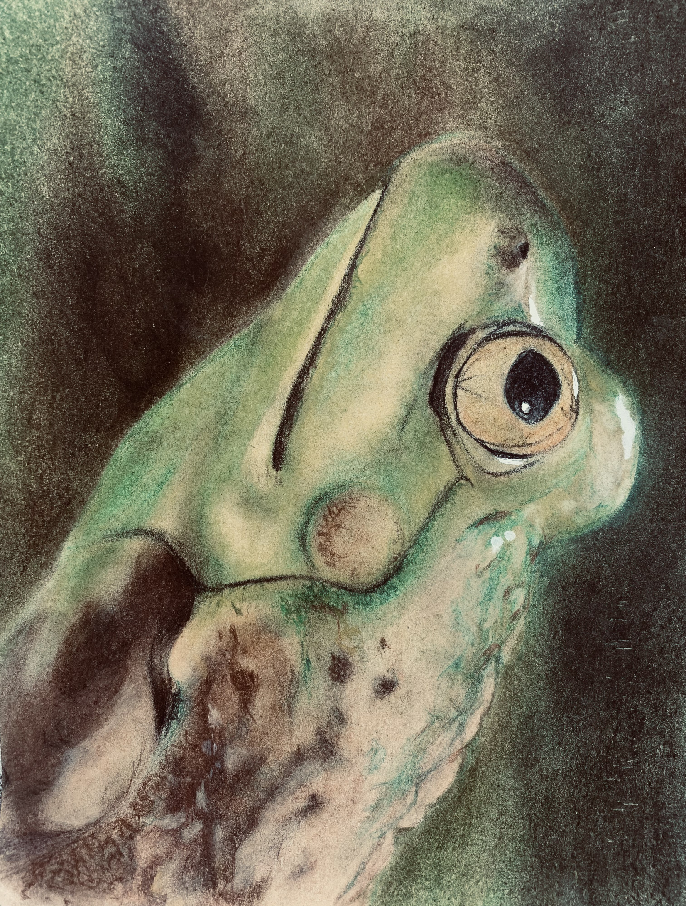
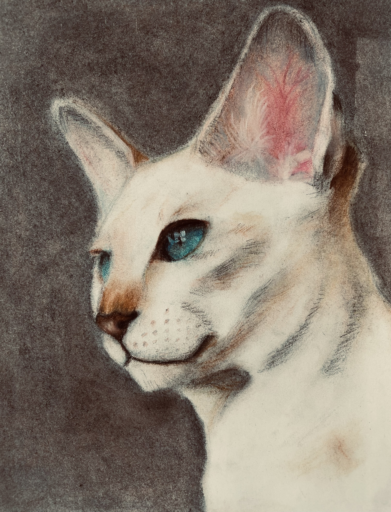
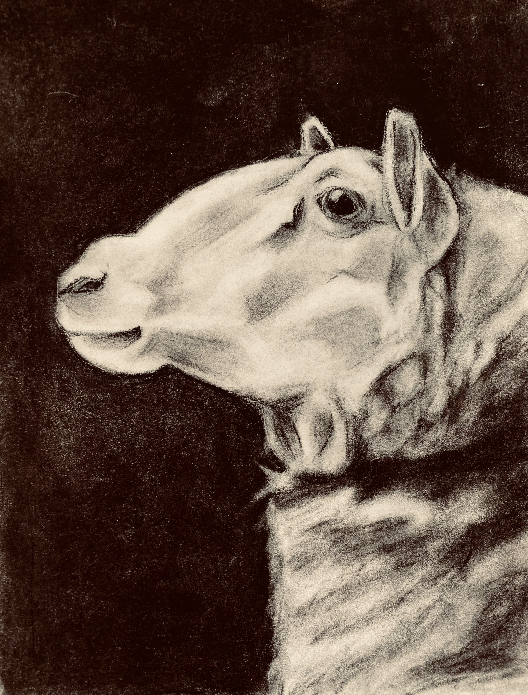

# Jeff Dang Pastel Studio

# Jeff Dang
# Anatomical Avian Landscape, (2025)
# Pastel on paper
# I wanted to treat the bird as a landscape rather than a subject. By cropping in so tight, the focus shifts to the heavy architecture of the beak and the repetitive, almost mechanical patterns of the feathers. It’s less about the "pretty bird" and more about the raw, structural power of the animals anatomy.

# Jeff Dang
# Loss of Innocence, (2024)
# Pastel on paper
# The young puppy sheds a tear with a looming dark palette showing grievance and loss of emotional freedom at a young age.

# Jeff Dang
# Strangeness of the Biological World,(2024)
# Pastel on paper 
# I went with an upward, awkward angle to make a small creature feel monumental. The goal was to capture that damp, organic texture of the skin against the glassy, unblinking eye—creating a sense of a prehistoric observer that’s completely indifferent to us

# Jeff Dang
# Heightened, (2023)
# Pastel on paper
# This was a study in intuition. I focused on the translucency of the ears and the way light sits in the eye to capture that specific, eerie sense of alertness they have. It’s about that moment when a cat is looking at something in the room that you can't see.

# Jeff Dang
# Chosen one Forgotten, (2023)
# Pastel on paper
# The pallet makes the room ancient. The irony of the lamb being the chosen one. This is a portrait of a figure lost to time.
